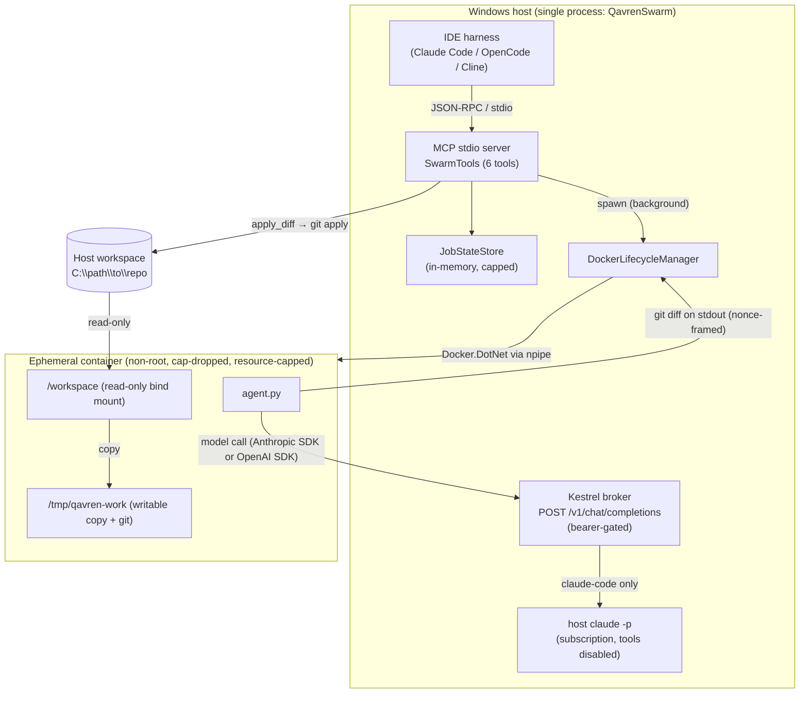

# Qavren Swarm

[](https://github.com/stevenfackley/Qavren-Swarm/actions/workflows/ci.yml)
[](LICENSE)

A local **Model Context Protocol (MCP)** server that orchestrates ephemeral, hardened Docker
containers as disposable coding agents. An IDE harness (Claude Code, OpenCode, Cline, …) talks
JSON‑RPC over **stdio**; each task spawns a throwaway Linux container that edits a **read‑only
copy** of a host workspace, runs tests, and returns a `git diff`. **Nothing touches your real
files until you explicitly call `apply_diff`.**

Built for a single developer on a Windows 11 workstation with Docker Desktop (WSL2). The model
backend is pluggable **per task**:

| Provider      | Backend                                                     | Cost            |
|---------------|-------------------------------------------------------------|-----------------|
| `claude-code` | Your logged‑in Claude Code CLI (`claude -p`) via a host broker | flat‑rate (subscription) |
| `openai`      | Any OpenAI‑compatible endpoint (Ollama / LM Studio / vLLM)  | local / free    |
| `anthropic`   | Metered Anthropic API                                       | per‑token       |

Default provider is `claude-code`.

> **Full documentation:** [PRD](docs/PRD.md) · [SDD](docs/SDD.md) · [STD](docs/STD.md) ·
> [PDD](docs/PDD.md) · [SECURITY](SECURITY.md)

---

## Architecture



**Key idea:** for `claude-code` the container never knows it is talking to Claude Code. The host
exposes an **OpenAI‑compatible** broker; the container's `OPENAI_BASE_URL` points at it; the broker
translates each request into a `claude -p` invocation on the host. So the agent only ever speaks
two dialects — Anthropic‑native or OpenAI — and subscription credentials **never enter a
container**.

### Request lifecycle

1. **`spawn_sandbox`** validates input, creates a job, and returns a `jobId` immediately. A
   background task runs the container under a per‑job wall‑clock timeout.
2. **`DockerLifecycleManager`** lazily builds the agent image (from an in‑memory tar of embedded
   resources), then creates a hardened container with the workspace bind‑mounted **read‑only** at
   `/workspace`, injects task parameters + a per‑job **nonce** as environment variables, starts it,
   and waits.
3. **`agent.py`** copies `/workspace` → `/tmp/qavren-work`, `git init`s a baseline, gathers source
   into a budgeted prompt, calls the model for **SEARCH/REPLACE** edits, applies them (preserving
   each file's CRLF/LF), retries once for unmatched hunks, runs tests if present, and prints the
   `git diff` framed by nonce‑stamped sentinels.
4. The host captures the container's stdout, parses the diff envelope, removes the container, and
   stores the result.
5. **`retrieve_diff`** returns the diff for review; **`apply_diff`** is the only operation that
   writes to the real workspace (`git apply`).

---

## Prerequisites

- **Docker Desktop** with the **Linux** engine, reachable at `npipe://./pipe/docker_engine`.
- **.NET 10 SDK** (built and verified against 10.0.301).
- For the **`claude-code`** provider only: the **`claude` CLI** installed and logged in on the host.
- For the **`anthropic`** provider only: `ANTHROPIC_API_KEY` present in the server's environment.
- For the **`openai`** provider: a reachable OpenAI‑compatible endpoint (default points at a local
  Ollama on `host.docker.internal:11434`).

## Build

```powershell
dotnet build -c Release          # or: dotnet publish -c Release
dotnet test  tests/QavrenSwarm.Tests.csproj   # 8 xUnit contract tests
python -m pytest tests/test_agent.py           # 5 agent.py tests
```

The two agent images (`qavren-agent-node`, `qavren-agent-python`) are **built by the server on
first use** from build context embedded in the assembly — no separate `docker build` step.

## Register the server (same binary, three hosts)

> Only the `anthropic` provider needs `ANTHROPIC_API_KEY`. For `claude-code` / `openai`, omit it.

**Claude Code** — `.mcp.json` (or `claude mcp add qavren-swarm -- dotnet <path>\QavrenSwarm.dll`):

```json
{
  "mcpServers": {
    "qavren-swarm": {
      "command": "dotnet",
      "args": ["C:\\Users\\steve\\projects\\Qavren-Swarm\\bin\\Release\\net10.0\\QavrenSwarm.dll"]
    }
  }
}
```

**OpenCode** — `opencode.json` (note: the key is `environment`, not `env`):

```json
{
  "$schema": "https://opencode.ai/config.json",
  "mcp": {
    "qavren-swarm": {
      "type": "local",
      "command": ["dotnet", "C:\\Users\\steve\\projects\\Qavren-Swarm\\bin\\Release\\net10.0\\QavrenSwarm.dll"],
      "enabled": true
    }
  }
}
```

**Cline** — `cline_mcp_settings.json`: identical shape to the Claude Code `mcpServers` block.

---

## Tools

All tools return JSON. Invalid input (bad runtime/provider/path, unknown `jobId`, un‑appliable
patch, failed `git apply`) is returned as an **MCP tool error** (`isError: true`), not a success
result. Job‑level outcomes (a `Failed` status, non‑zero `failedHunks`) are normal results — they
are data, not protocol errors.

| Tool | Parameters | Returns |
|------|------------|---------|
| `spawn_sandbox` | `runtime` (`node`\|`python`), `workspacePath` (abs.), `task`, `provider?`, `model?`, `thinkingBudget?` | `{ jobId, status, provider, runtime }` |
| `check_sandbox_status` | `jobId` | `{ status, exitCode?, testsPassed, failedHunks, hasChanges, error }` |
| `list_jobs` | — | `{ count, jobs[] }` (newest first; recovers a dropped `jobId`) |
| `cancel_job` | `jobId` | `{ cancelling: true }` — stops the container, marks the job `Failed` |
| `retrieve_diff` | `jobId` | `{ status, testsPassed, failedHunks, diff }` (advisory; host untouched) |
| `apply_diff` | `jobId` | `{ applied: true, workspacePath }` — the only host‑mutating op |

Statuses: `Pending → Running → Completed | Failed`.

---

## Configuration (environment variables)

Server‑side (read once at startup):

| Var | Default | Purpose |
|-----|---------|---------|
| `QAVREN_DEFAULT_PROVIDER` | `claude-code` | provider used when `spawn_sandbox` omits one |
| `QAVREN_BROKER_PORT` | `8787` | Kestrel port containers reach via `host.docker.internal` |
| `QAVREN_BROKER_ENABLED` | `true` | set `false` to disable the broker (e.g. the work box) |
| `QAVREN_CLAUDE_BIN` | `claude` | Claude Code CLI binary name / path |
| `QAVREN_CLAUDE_CODE_MODEL` | `sonnet` | model alias forwarded to `claude -p --model` |
| `QAVREN_ANTHROPIC_MODEL` | `claude-sonnet-4-6` | model for the `anthropic` provider |
| `QAVREN_THINKING_BUDGET` | `8000` | extended‑thinking budget (anthropic) |
| `QAVREN_OPENAI_BASE_URL` | `http://host.docker.internal:11434/v1` | OpenAI‑compatible endpoint |
| `QAVREN_OPENAI_MODEL` | `qwen2.5-coder` | model for the `openai` provider |
| `QAVREN_JOB_TIMEOUT_SECONDS` | `900` | per‑job wall‑clock cap (then the container is killed) |
| `QAVREN_BROKER_TIMEOUT_SECONDS` | `300` | per‑`claude -p` cap |
| `QAVREN_PIDS_LIMIT` | `512` | container PID cap (fork‑bomb guard) |
| `QAVREN_MEMORY_MB` | `2048` | container memory cap |
| `QAVREN_CPUS` | `2` | container CPU cap |
| `QAVREN_NETWORK_MODE` | _(bridge)_ | set `none` for offline / local‑only runs |
| `QAVREN_LOG_FILE` | `<bin>/logs/qavren.log` | log file (stdout is reserved for JSON‑RPC) |

Agent‑side (forwarded into the container only when set in the server environment):

| Var | Default | Purpose |
|-----|---------|---------|
| `QAVREN_CONTEXT_BUDGET` | `200000` | max chars of repo inlined into the prompt (lower for small local models) |
| `QAVREN_TEST_TIMEOUT` | `300` | per‑step timeout for `npm install` / `npm test` / `pytest` |
| `QAVREN_MAX_TOKENS` | `8192` | model `max_tokens` (added to the thinking budget for anthropic) |

Secrets that may apply depending on provider: `ANTHROPIC_API_KEY` (anthropic), `OPENAI_API_KEY`
(openai; defaults to `local` if unset).

---

## Security model (summary)

- **Read‑only mount + explicit apply.** The workspace is mounted read‑only; the agent edits an
  isolated copy. `apply_diff` (`git apply`) is the only operation that writes to your files, and
  git refuses `.git/`‑ and `..`‑targeting patches.
- **Container hardening.** Non‑root user, `--cap-drop ALL`, `no-new-privileges`, and pids/memory/CPU
  caps. Tests run with `npm install --ignore-scripts` and per‑step timeouts. `QAVREN_NETWORK_MODE=none`
  cuts egress for offline runs.
- **Broker isolation.** Bound `0.0.0.0:<port>` (so containers can reach it) and gated by a random
  per‑session bearer token, constant‑time compared. The host `claude` runs with `--disallowedTools`
  in an empty scratch directory — a pure text engine that cannot touch the host filesystem.
- **Unforgeable output.** The stdout diff envelope is framed with a per‑job nonce the model never
  sees, so injected task text cannot fake it.
- **CRLF integrity.** Each file's line endings are preserved end‑to‑end, so diffs are minimal and
  `git apply` matches cleanly on Windows hosts.

See [SECURITY.md](SECURITY.md) and the [SDD](docs/SDD.md) §Security for the full threat model.

---

## Project layout

```
QavrenSwarm.csproj          .NET 10 Web SDK (stdio MCP + Kestrel broker in one process)
Program.cs                  Host wiring: logging→stderr/file, DI, MCP server, broker endpoint
Services/
  SwarmConfig.cs            Env-driven config + per-session broker token
  JobState.cs               Per-job record (+ CancellationTokenSource)
  JobStateStore.cs          Concurrent job registry with capped eviction
  DockerLifecycleManager.cs Image build (embedded tar), container run, log demux, diff parse
  ClaudeCodeBroker.cs       OpenAI-compatible shim → host `claude -p`
  FileLogger.cs             Append-only file logger (held writer)
Tools/SwarmTools.cs         The 6 MCP tool handlers
Agent/                      Embedded build context for the agent images
  Dockerfile.node           node:22-alpine, non-root
  Dockerfile.python         python:3.12-slim, non-root
  agent.py                  The in-container coding agent
  requirements.txt          anthropic + openai SDKs (shared by both images)
tests/                      xUnit contract tests + agent.py pytest
docs/                       PRD, SDD, STD, PDD
```

## License

[MIT](LICENSE) © 2026 Steven Fackley.
